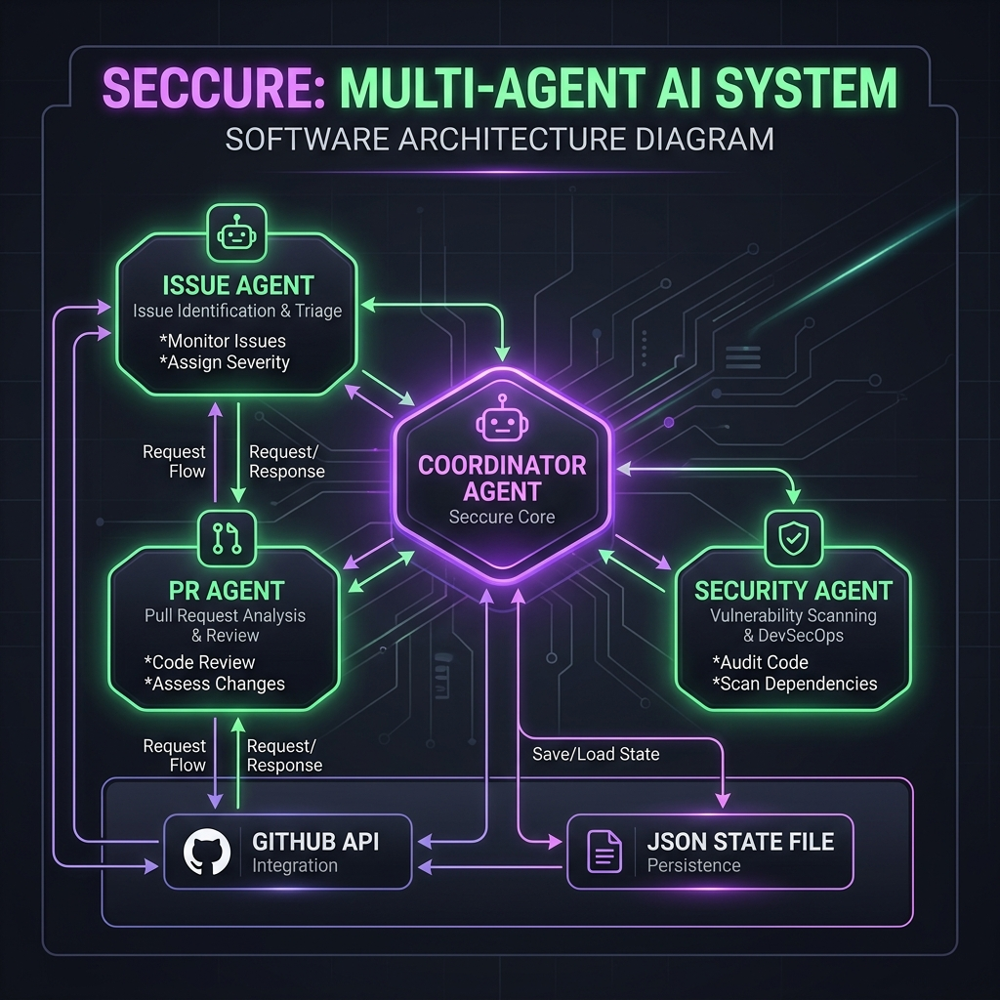

<div align="center">
  
  <h1>🛡️ Seccure — AI GitHub Dependabot Auto-Fix Agent</h1>
  <p><em>The autonomous multi-agent AI system that patches security vulnerabilities while you sleep.</em></p>
</div>

[](https://github.com/owner/seccure/actions/workflows/ci.yml)
[](https://github.com/owner/seccure/actions/workflows/publish-image.yml)
[](https://opensource.org/licenses/MIT)
[](https://www.python.org/downloads/release/python-3120/)
[](https://github.com/pre-commit/pre-commit)

Seccure runs as a completely unattended background agent. It gathers alerts, PRs, and issues, orchestrates a series of fix strategies (`npm audit fix`, package overrides, manual bumps), and opens a single consolidated pull request fixing everything it can. Unfixable vulnerabilities are cleanly documented as conflict issues.

---

## 🚀 How to use Seccure in your repositories

Seccure is distributed as a **Docker image**. You don't need to install Python or LangChain in your target repositories. You just need to drop in a single GitHub Actions workflow file.

### 1. Prerequisites (Target Repo)

Enable the following in your target repository's **Settings → Security & analysis**:
- ✅ **Dependency graph**
- ✅ **Dependabot alerts**

Create the following labels using the GitHub CLI:
```bash
gh label create "security"   --color "e11d48"
gh label create "dependabot" --color "0075ca"
gh label create "seccure"    --color "7c3aed"
gh label create "auto-fix"   --color "059669"
gh label create "conflict"   --color "f59e0b"
```

Add your OpenRouter API key as a repository secret:
- **Settings → Secrets and variables → Actions → New repository secret**
- Name: `OPENROUTER_API_KEY`
- Value: Your key from [OpenRouter](https://openrouter.ai/)

### 2. Add the Workflow

Copy this workflow into `.github/workflows/seccure.yml` in your target repository. (Make sure to replace `owner` with the GitHub organization/user that hosts the Seccure Docker image).

```yaml
name: 🛡️ Seccure — Auto Security Fix

on:
  schedule:
    - cron: '0 2 * * 1'       # Every Monday 02:00 UTC
  workflow_dispatch:            # Manual on-demand trigger
    inputs:
      target_repo:
        description: 'Target repo (owner/repo). Leave blank to use current repo.'
        required: false
        default: ''
      additional_constraints:
        description: |
          One-off extra constraints for this run only (plain text).
          Example: "Do not upgrade react beyond 18.x"
        required: false
        default: ''

permissions:
  contents: write              # clone repo, push fix branch
  pull-requests: write         # create / close PRs
  issues: write                # read + create conflict issues
  security-events: read        # read Dependabot alerts & code scanning

jobs:
  seccure:
    runs-on: ubuntu-latest
    timeout-minutes: 30
    steps:
      - name: Run Seccure Agent
        uses: docker://ghcr.io/owner/seccure:latest
        env:
          OPENROUTER_API_KEY: ${{ secrets.OPENROUTER_API_KEY }}
          GITHUB_TOKEN: ${{ github.token }}
          TARGET_REPO: ${{ inputs.target_repo || github.repository }}
          ADDITIONAL_CONSTRAINTS: ${{ inputs.additional_constraints || '' }}

      - name: Upload state artifact
        if: always()
        uses: actions/upload-artifact@v4
        with:
          name: seccure-state-${{ github.run_id }}
          path: ${{ github.workspace }}/seccure_state_*.json
```

### 3. Customise Behaviour (Optional)

If your repository has specific constraints (e.g. "Do not upgrade TypeScript to a major version"), you can create a `.seccure/constraints.md` file in the target repository.

The Seccure Coordinator agent reads this file and injects the rules directly into its planning prompt, ensuring fixes respect your boundaries.

**Example `.seccure/constraints.md`**:
```markdown
## Seccure Constraints for this Repo

- Do NOT upgrade `typescript` to any major version.
- Prefer `npm overrides` for transitive dependency fixes.
- Do not modify `engines.node` in package.json.
```

If a constraint blocks a fix, Seccure will skip the patch and automatically create a conflict issue explaining that the repo constraint blocked the fix.

---

## Architecture Overview

<div align="center">
  
</div>

Seccure uses a **Coordinator-Subagent architecture** driven by OpenRouter:

1. **Coordinator Agent** (`openai/gpt-5-nano` via OpenRouter): Orchestrates the entire flow. It has access to safe, Python-wrapped subprocess shell tools (`git clone`, `npm audit fix`) and GitHub write tools. The Coordinator manages all state and implements a secure teardown (`git reset --hard`) on unexpected failures.
2. **IssueAgent**, **PRAgent**, **SecurityAgent** (`openai/gpt-4o-mini` via OpenRouter): Narrow-context subagents equipped with strictly read-only tools. They read GitHub APIs and return structured Pydantic summaries (`AlertSummary`, etc.) back to the Coordinator, eliminating the risk of subagents corrupting state.

All LLM actions run unattended through deterministic Python tools with bounded tool-call budgets and redacted logs. The `TARGET_REPO` environment variable is strictly enforced at multiple layers (MCP client, GitHub API, git commands), proactively verifying permissions and immediately exiting upon mismatch to prevent cross-repository contamination.
